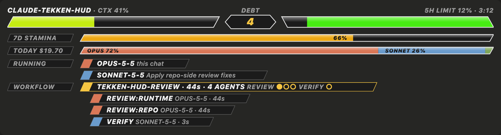
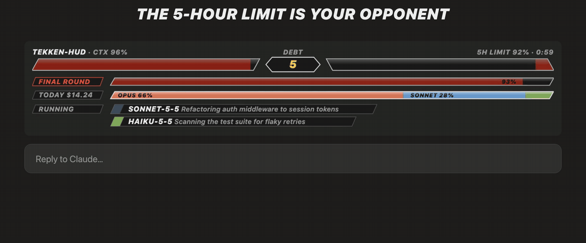

# Tekken HUD for Claude Code

Your Claude Code session, as a fighting game. Context window, rate limits, daily spend, tech debt and your running subagents become health bars, stamina, nameplates and a K.O. toast, drawn above the prompt.

https://github.com/user-attachments/assets/66344f22-7c74-44cb-829c-7b959ea552c1


## What you're looking at

**P1** is your context window. The bar fills as the conversation grows, going green to yellow to red, and pulses past 90%.


**P2** is your 5-hour limit, draining toward the reset, with a countdown to when it refills.

**DEBT**, the round timer in the middle, counts the `ponytail:` shortcut markers in the project you're working in (the git root of the last file touched). Every corner you cut and flagged shows up here.

**7D STAMINA** is your 7-day limit. Past 90% it flips to **FINAL ROUND**.


**TODAY $** is today's spend broken down by model, via ccusage.

**RUNNING** shows one nameplate per live agent, with its model and its duty.


**WORKFLOW** shows each multi-agent workflow run as a gold plate: its name, how long it has run, how many agents it started, and a pip per agent in each phase (filled when done). Under it, a nameplate per agent still running, with its label, model and time; past four they fold into `+N more`. A finished run clears itself after 30 seconds.



**K.O.** pops as a toast when the 5-hour limit hits 100%, the moment P2's bar runs out. (The big K.O. lettering is from the launch video; in the app you get the toast.)



## Install

One line sets up the prerequisites (Node and a pinned ccusage, via Homebrew on macOS; no sudo, safe to re-run):

```
curl -fsSL https://raw.githubusercontent.com/dpdev69/claude-tekken-hud/main/setup.sh | sh
```

Then in Claude Code:

```
/plugin marketplace add dpdev69/claude-tekken-hud
/plugin install tekken-hud@claude-tekken-hud
```

and `/reload-plugins` to load it into an open session.

## Requirements

What `setup.sh` checks for, and what happens without each:

| | Used for | Without it |
|---|---|---|
| git | the DEBT count (`git grep`, so ignored files stay out) | DEBT shows `?` |
| Node | runs ccusage for the TODAY spend row | the TODAY row hides |
| ccusage 20.0.26 | today's spend by model | falls back to `npx`, a few seconds slower per turn |

`sh setup.sh --check` reports what's missing without installing anything. The desktop app doesn't load your shell profile, so the hooks add `/opt/homebrew/bin` and `/usr/local/bin` to the app's own PATH; a `ccusage` or `node` installed by nvm, volta or fnm needs a symlink into `/usr/local/bin`.

The desktop app's Code tab draws the full HUD; the terminal gets a text fallback.

## Rebuild the media

Needs Google Chrome (set `CHROME` to use another path) and `ffmpeg` on your PATH.

```
npm install
npm run gifs
npm run video
```

`media/ko.gif` is cut from `media/launch.mp4`:

```
ffmpeg -ss 24.5 -t 4 -i media/launch.mp4 -vf "crop=1920:800:0:240,fps=15,scale=1100:-1:flags=lanczos,split[a][b];[a]palettegen=stats_mode=diff[p];[b][p]paletteuse=dither=bayer:bayer_scale=4" -loop 0 media/ko.gif
```

MIT.
