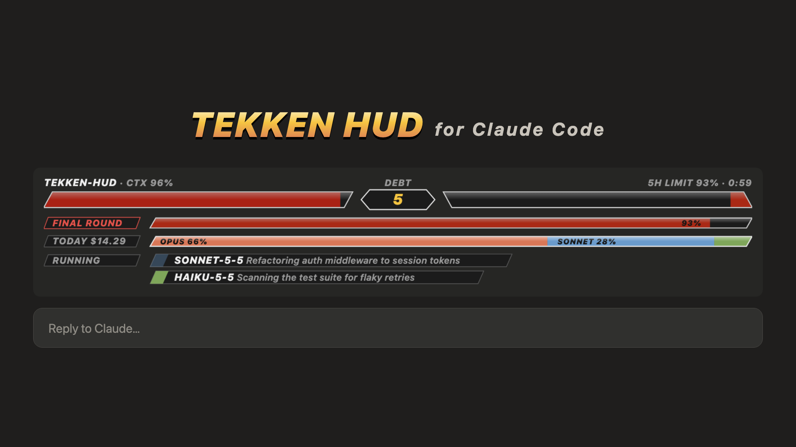
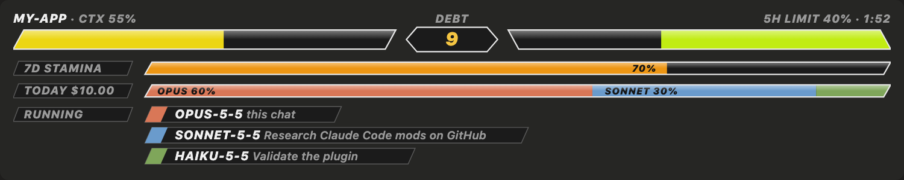
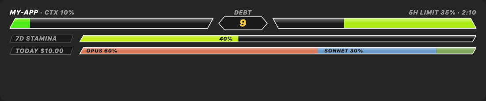
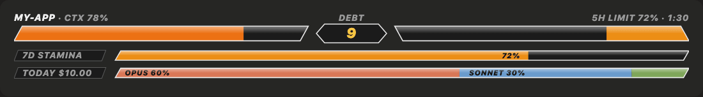
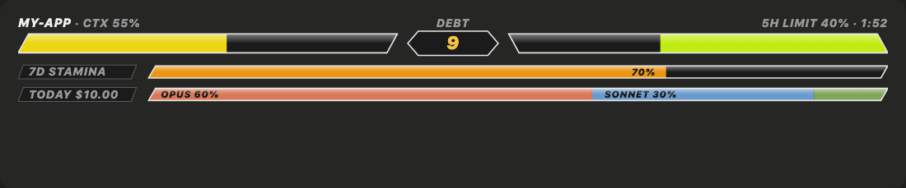

# Tekken HUD for Claude Code

Your Claude Code session, as a fighting game. Context window, rate limits, daily spend, tech debt and your running subagents become health bars, stamina, nameplates and a K.O. toast, drawn above the prompt.

[](media/launch.mp4)



## What you're looking at

**P1** is your context window. The bar fills as the conversation grows, going green to yellow to red, and pulses past 90%.



**P2** is your 5-hour limit, draining toward the reset, with a countdown to when it refills.

**DEBT**, the round timer in the middle, counts the `ponytail:` shortcut markers in the project you're working in (the git root of the last file touched). Every corner you cut and flagged shows up here.

**7D STAMINA** is your 7-day limit. Past 90% it flips to **FINAL ROUND**.



**TODAY $** is today's spend broken down by model, via ccusage.

**RUNNING** shows one nameplate per live agent, with its model and its duty.



**K.O.** pops as a toast when the 5-hour limit hits 100%.

## Install

```
/plugin marketplace add dpdev69/claude-tekken-hud
/plugin install tekken-hud@claude-tekken-hud
```

Then `/reload-plugins`.

## Requirements

- [ripgrep](https://github.com/BurntSushi/ripgrep) (`rg`) for the DEBT count.
- Node/npx for spend (runs `ccusage`). Optional: the TODAY row hides without it.
- The desktop app's Code tab draws the full HUD. The terminal gets a text fallback.

## Rebuild the media

```
npm install
npx tsx scripts/gifs.ts
npx tsx scripts/video.ts
```

MIT.
